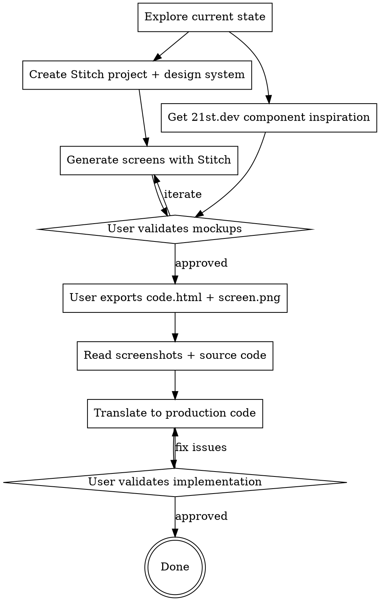

# Stitch-Driven Design

Design pages by generating visual mockups first, validating with the user, then translating to production code. Never build visual UI from text descriptions alone — always have a validated reference image.

## When to Use

- Designing a new page or major section
- Redesigning an existing page to match a new visual direction
- User says "make it look like X", "redesign this", "improve the design"
- Building components that need to look polished and branded

## When NOT to Use

- Bug fixes or logic changes with no visual impact
- Adding a single small element to an existing design
- Backend-only work

## The Process



## Step 1: Explore Current State

Before designing, understand what exists. Read the current components, CSS, and page structure. Note what works and what needs to change.

## Step 2: Create Stitch Project + Design System

Use the Stitch MCP to create a project and design system that matches the brand:

```
mcp__stitch__create_project → get project ID
mcp__stitch__create_design_system → apply brand tokens
```

**Design system parameters to set:**
- `headlineFont` / `bodyFont` — match project fonts (use closest available if exact font not in Stitch)
- `customColor` — primary brand color
- `overridePrimaryColor` / `overrideSecondaryColor` / `overrideTertiaryColor` — brand palette
- `overrideNeutralColor` — background color
- `colorVariant` — typically VIBRANT for warm brands
- `roundness` — ROUND_TWELVE for generous rounding
- `colorMode` — LIGHT or DARK
- `designMd` — brief markdown describing the visual language

## Step 3: Generate Screens with Stitch

Generate mockup screens with descriptive prompts:

```
mcp__stitch__generate_screen_from_text
```

**Prompt tips:**
- Be specific about layout (grid columns, heights, positioning)
- Name actual content (trip names, restaurant names, dates)
- Describe glassmorphism, shadows, and effects explicitly
- Reference the established design system in the prompt
- Use `GEMINI_3_FLASH` for speed, `GEMINI_3_1_PRO` for quality

**Known issues:**
- `generate_screen_from_text` often returns "completed with no output" — screens may still generate on the backend
- `list_screens` may return empty even when screens exist
- The user needs to check the Stitch web UI at stitch.withgoogle.com to see generated screens
- If a project stops generating, create a fresh project

## Step 4: Get 21st.dev Component Inspiration

Use 21st.dev MCP in parallel with Stitch for component patterns:

```
mcp___21st-dev_magic__21st_magic_component_inspiration
```

**Good search queries (2-4 words max):**
- "3d scroll animation hero"
- "interactive card tilt"
- "scroll storytelling parallax"
- "timeline component glass"
- "flight card boarding pass"

21st.dev returns full React + Tailwind code snippets. Extract the patterns (spring configs, scroll techniques, layout approaches) — don't copy verbatim.

## Step 5: User Validates Mockups

The user must see and approve the Stitch mockups before implementation begins. Direct them to the Stitch web UI to view the generated screens.

**Critical:** Stitch screenshot URLs (lh3.googleusercontent.com) require authentication and won't load in a browser or visual companion. The user must export from the Stitch web UI.

## Step 6: User Exports Reference Files

Ask the user to download from Stitch and provide local paths. Three export types:

**Individual screens:** `code.html` + `screen.png` per screen — good for visual reference and specific section HTML.

**Vite app export (THE PRIMARY REFERENCE):** Full project with `src/App.tsx` + `src/index.css` + `package.json`. This is a complete runnable React + Tailwind app that Stitch generates. It contains:
- Full React components with props, state, and event handlers
- Exact Tailwind classes for every element (translate these to your CSS)
- Real content (text, image URLs, data structures)
- Layout structure (grids, flex, positioning)
- Interaction patterns (hover states, active states, transitions)
- Design tokens in `index.css` (colors, fonts, glass panel definitions)

**Always ask the user to export the Vite app** — it's dramatically more useful than code.html because it has structured React components rather than flat HTML. When translating to production code, map each Stitch component to your project's component structure and translate the Tailwind utilities to pure CSS.

**Design system markdown:** `DESIGN.md` file in individual screen exports — contains the generated design system rules.

## Step 7: Read Screenshots + Source Code

Read the screenshot images to see the visual target:
```
Read tool → screen.png (multimodal — you can see the image)
```

Read the Vite app source code (primary reference):
```
Read tool → src/App.tsx      (React components — THE key file, maps 1:1 to what you build)
Read tool → src/index.css    (design tokens, glass panel classes, font imports)
Read tool → package.json     (dependencies — shows what libraries Stitch used)
```

Read individual screen exports (secondary reference):
```
Read tool → code.html        (flat HTML with Tailwind — useful for specific sections)
Read tool → DESIGN.md        (generated design system rules)
```

**What to extract from the code:**
- Exact colors (hex values from Tailwind config)
- Spacing/sizing (Tailwind units → rem/px)
- Border radius values
- Shadow definitions
- Glass panel properties (background opacity, blur amount)
- Font weights and sizes
- Layout grid (columns, gaps)
- Hover/active states

## Step 8: Translate to Production Code

Translate Tailwind classes from Stitch to the project's CSS approach. Common translations:

| Tailwind | Pure CSS |
|----------|----------|
| `bg-white/70` | `background: rgba(255,255,255,0.7)` |
| `backdrop-blur-xl` | `backdrop-filter: blur(24px)` |
| `rounded-3xl` | `border-radius: 1.5rem` |
| `shadow-2xl` | `box-shadow: 0 25px 50px -12px rgba(0,0,0,0.25)` |
| `text-5xl font-black` | `font-size: 3rem; font-weight: 900` |
| `tracking-tight` | `letter-spacing: -0.025em` |
| `ring-1 ring-white/50` | `border: 1px solid rgba(255,255,255,0.5)` |

**Implementation approach:**
1. Build section by section (hero first, then grid, then cards)
2. Use the Stitch screenshot as the pixel target
3. Use the Stitch code for exact values
4. Verify build compiles after each section (`npm run typecheck`)
5. Have the user check each section visually

## Common Mistakes

| Mistake | Fix |
|---------|-----|
| Building from text descriptions without mockups | Always generate Stitch mockups first |
| Delegating visual work to subagents who can't see mockups | Write visual CSS yourself or provide exact values to subagents |
| Using Stitch screenshot URLs directly in HTML | URLs need auth — user must export files locally |
| Forgetting mobile degradation | Always add `backdrop-filter: none` fallback on mobile |
| Not checking which component the route actually renders | Verify the import chain: route → page → component |
| Merges reverting design changes | After merges, verify key files still import new components |

## Combining with Other Tools

**ui-ux-pro-max skill:** Use BEFORE Step 2 to generate a design system with style, color, typography, and UX recommendations. Feed its output into the Stitch design system creation. Also use its pre-delivery checklist after implementation.

```bash
# Generate full design system
python3 ~/.claude/skills/ui-ux-pro-max/scripts/search.py "<keywords>" --design-system -p "Project Name"

# Search specific domains
python3 ~/.claude/skills/ui-ux-pro-max/scripts/search.py "<keywords>" --domain style
python3 ~/.claude/skills/ui-ux-pro-max/scripts/search.py "<keywords>" --domain color
python3 ~/.claude/skills/ui-ux-pro-max/scripts/search.py "<keywords>" --domain typography
```

**brainstorming skill:** Use before this skill to explore the design direction with the user. Brainstorming identifies WHAT to build; this skill handles HOW it looks.

**framer-motion / Three.js:** Layer animations on top of the Stitch-matched static design. The Stitch mockup is the visual foundation; scroll effects, spring physics, and 3D elements are the enhancement layer.
